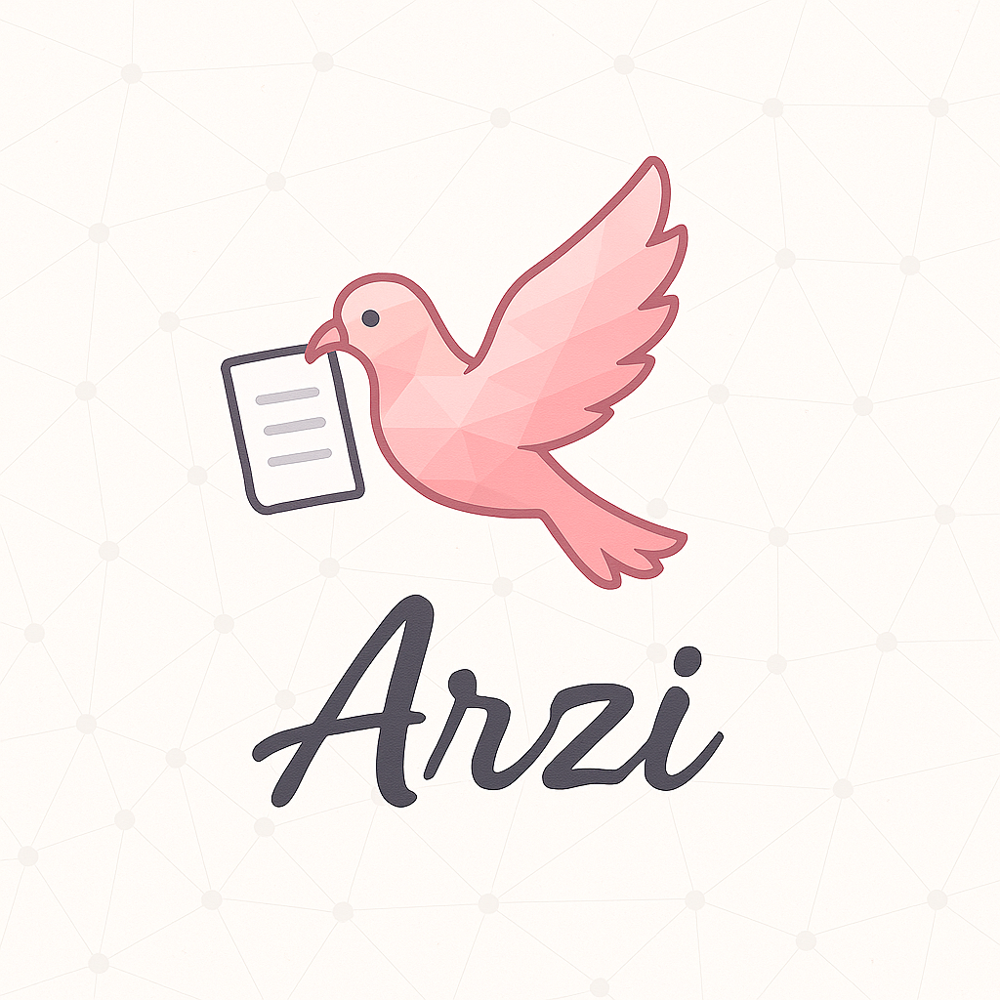
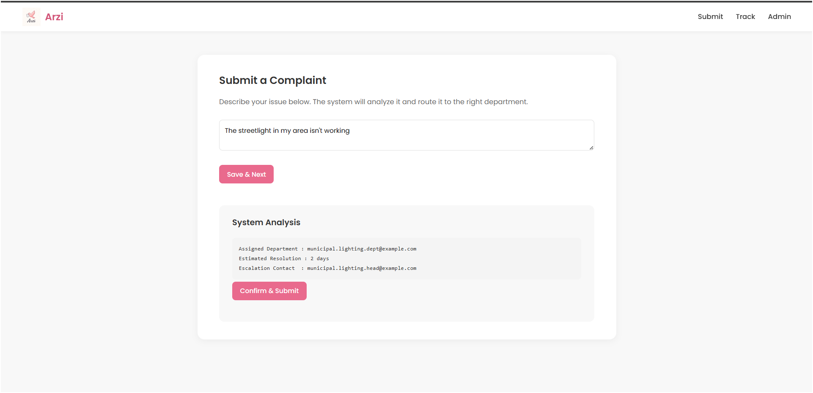
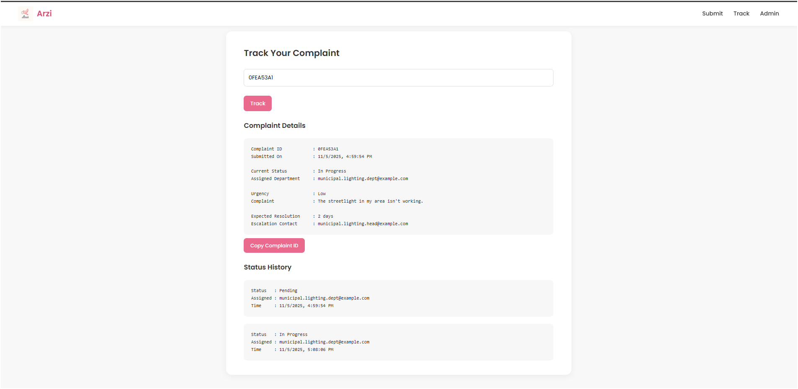
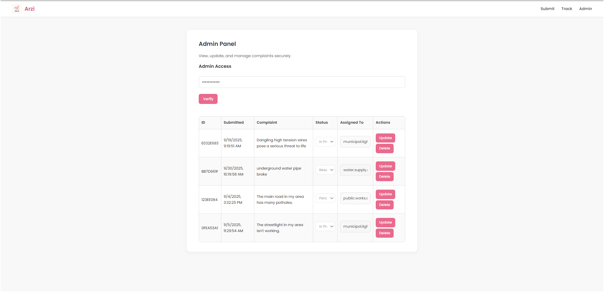
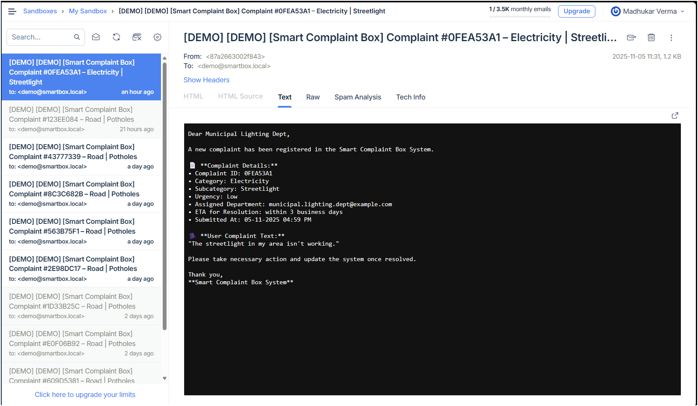

<p align="center">
  
</p>
<h1 align="center">🏛️ Arzi — Smart Complaint Management System</h1>
<p align="center"><em>“Where Every Pigeon Carries a Promise”</em></p>

<p align="center">
  
  
  
  
</p>

---

## ⚙️ Features

- 🧠 **AI-based Classification:** Automatically categorizes complaints and determines urgency.  
- 📨 **Smart Routing:** Directs complaints to the right department or escalation authority.  
- 💻 **Modern Responsive UI:** Clean, mobile-friendly design inspired by the Arzi brand.  
- 🔍 **Tracking System:** Allows users to monitor complaint status with timestamps and logs.  
- 🧑‍💼 **Admin Dashboard:** Secure key-based access for authorized staff to view and update complaints.  
- 📈 **Transparent History:** Maintains a clear timeline of every complaint’s progress.  

---

### 🏠 **Complaint Submission (Index Page)**
<p align="center">
  
</p>

### 🔍 **Complaint Tracking Page**
<p align="center">
  
</p>

### 🧑‍💼 **Admin Dashboard**
<p align="center">
  
</p>

### ✉️ **MailTrap Integration (Notification Email Preview)**
<p align="center">
  
</p>

---

## 💻 Tech Stack / Technologies Used

Layer                | Technologies
---------------------|------------------------------------------------------------
Frontend             | HTML, CSS, JavaScript for user and admin interfaces
Backend Framework    | Flask (Python)
Machine Learning     | Scikit-learn, Pandas, Joblib
ML Models            | TF-IDF + Multinomial Naïve Bayes pipelines
Database             | SQLite (local) / PostgreSQL (production-ready)
Email System         | SMTP integration via Gmail or Mailtrap sandbox
Configuration        | dotenv for secure environment variable handling
Hosting              | Render / Local testing environment

---

## 🧱 Project Structure

```bash
arzi/
├── main.py                         # Entry point of the Flask app
│
├── backend/                        # Backend logic and blueprints
│   ├── __init__.py
│   ├── blueprints/
│   │   ├── user.py                 # User-side routes (submit, track)
│   │   └── admin.py                # Admin routes (verify, update, delete)
│   ├── classifier.py               # Complaint text classification
│   ├── router.py                   # Department routing logic
│   ├── storage.py                  # Complaint CRUD and DB operations
│   ├── email_sender.py             # Email and escalation notifications
│   ├── email_templates.py          # Email format templates
│   └── relay.py                    # Email relay and subject tagging
│
├── database/
│   ├── models.py                   # SQLAlchemy ORM models
│   └── __init__.py
│
├── ml_models/
│   ├── trainall.py                 # Model training script
│   └── trained_data/               # Serialized trained ML models (.pkl)
│       ├── category_model.pkl
│       ├── urgency_model.pkl
│       └── subcategory_models/
│
├── static/                         # Frontend files
│   ├── index.html                  # Complaint submission page
│   ├── track.html                  # Track status page
│   ├── admin.html                  # Admin dashboard
│   ├── style.css                   # Unified modern styling
│   ├── index.js                    # Client-side logic
│   ├── track.js
│   ├── admin.js
│   └── logo/
│       └── Arzi_logo.png           # Arzi brand logo
│
├── paths.py                        # Helper for path configuration
├── requirements.txt                # Python dependencies
├── .gitignore                      # Ignored build and cache files
└── README.md                       # Documentation
```
---

## 🧩 Database Schema

### **Complaint Table**

| Column        | Type         | Description |
|----------------|--------------|-------------|
| `id`           | Integer (PK) | Unique complaint ID |
| `complaint_id` | String       | Public complaint identifier (UUID short) |
| `user_input`   | Text         | Complaint description |
| `category`     | String       | Primary complaint category |
| `subcategory`  | String       | Subcategory under department |
| `urgency`      | String       | Low / Medium / High |
| `assigned_to`  | String       | Department or email handling the complaint |
| `status`       | String       | Current state (Pending / In Progress / Resolved) |
| `created_at`   | DateTime     | Time complaint was submitted |
| `updated_at`   | DateTime     | Last updated timestamp |

---

### **Status Logs Table**

| Column        | Type         | Description |
|----------------|--------------|-------------|
| `id`           | Integer (PK) | Log entry ID |
| `complaint_id` | String (FK)  | Associated complaint ID |
| `status`       | String       | Status update (e.g., “Forwarded”, “Resolved”) |
| `assigned_to`  | String       | Who handled the update |
| `timestamp`    | DateTime     | When the update occurred |

---

## 🧰 Future Enhancements
- 🔐 User authentication (Citizen login)
- 📊 Analytics dashboard for departments
- 🤖 NLP model upgrade for multi-language complaint analysis
- ☁️ Cloud-based file and image attachment support
- 🕵️ Anonymous complaint submission

---
